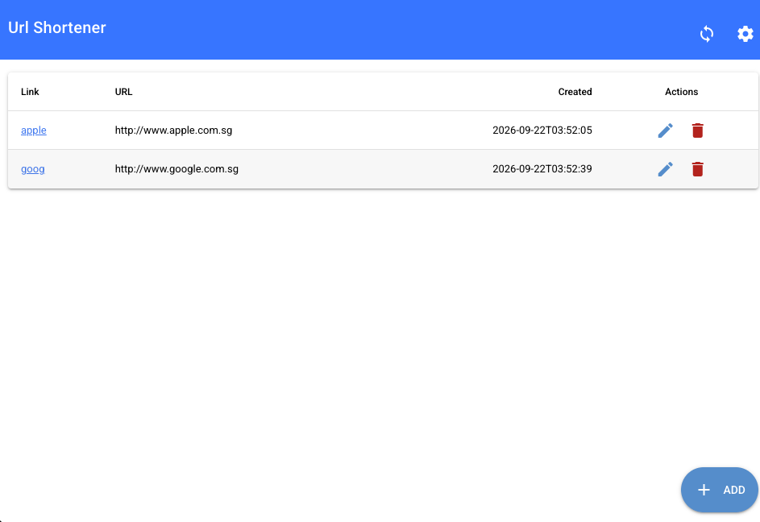
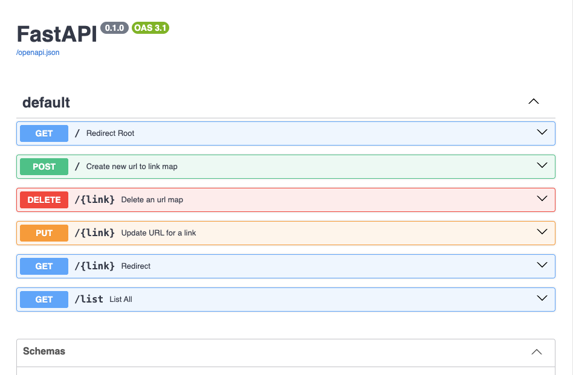
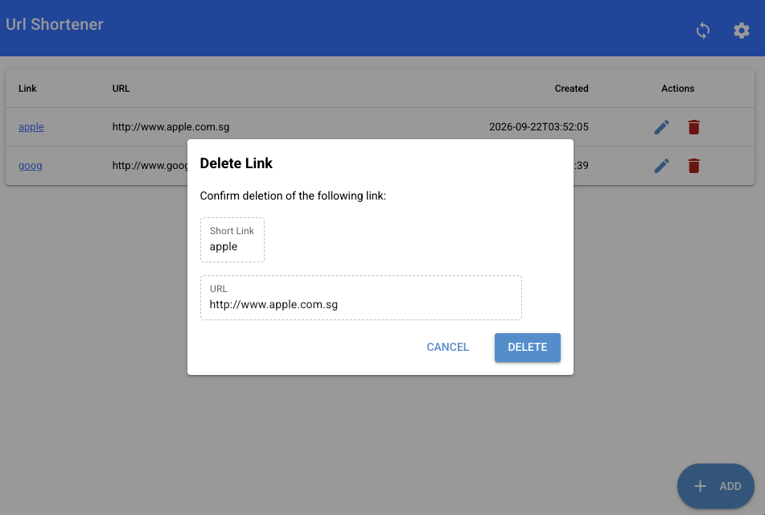
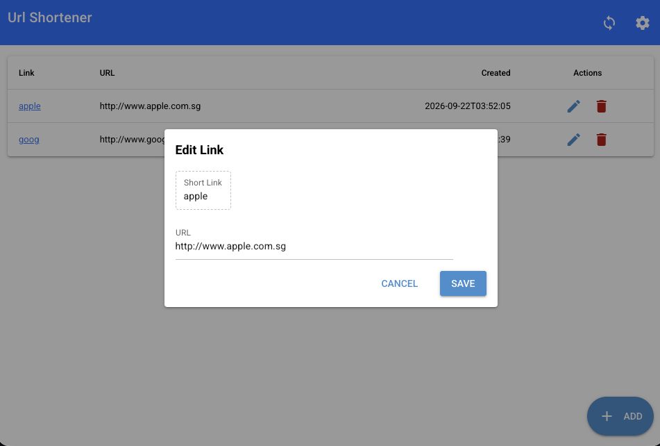
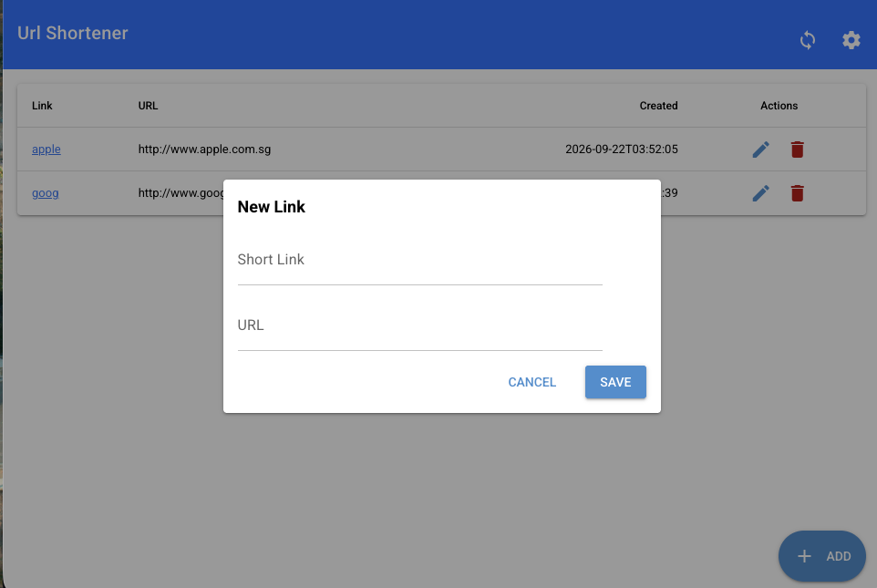
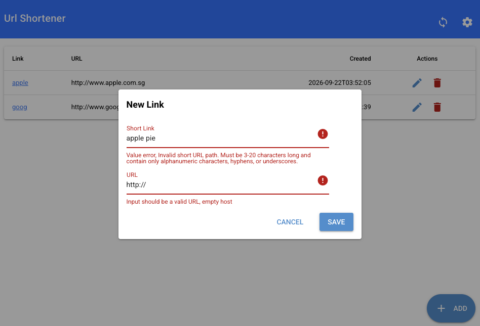

# url-shortener

## General overview

### Software Stack

This application is using FastAPI python library to create the backend on top of SQLAlchemy ORM. 
It provides two type of data storage/repository:
    - dictionary based in memory storage
    - sqlite based which can be configured to use memory or permanent database :
The code does not use config file yet but can be added in future.
Currently the repository is configured in dependencies.py to use sqlite database called database.db which will be created in this project folder.

For user interface due to time constraint, we are using Python wrapper of Vue called NiceGUI, to create websocket based UI.
Ideally the frontend should run on separate service and connect to backend using API provided.

Validation for API and UI is done using pydantic

## AI Usage

During this project development, AI was used to create test cases using vscode copilot. Most of the code is still written manually.

## setup environment

We are using FastAPI recommended virtual environment tool called ["uv"](https://docs.astral.sh/uv/#highlights)

To install use :

```bash

curl -LsSf https://astral.sh/uv/install.sh | sh

```

## Run
After uv is installed, we can simply call run.sh in mac or linux terminal. This will launch FastAPI in development mode.

Connect to http://127.0.0.1:8000 for ui 

Swagger api UI is given at http://127.0.0.1:8000/docs

## Test
To run test, we call test.sh


## Screenshots

Main user interface


Swagger user interface


Delete Dialog


Edit Dialog


Create New Link


Create New Link Validation Results


